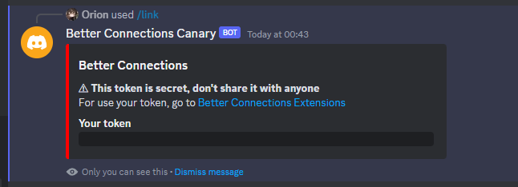
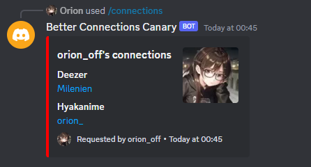
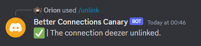

# Better Connections Bot
Better Connections is a simple bot for Discord for linking account with Better Connections.

Warning: This bot is still in development, so there may be bugs.

## Commands
### /link
#### Description
Get your token for linking account with the [extension](https://github.com/oriionn/better-connections-extensions).
#### Usage
`/link`
#### Response

### /connections
#### Description
See the connections of a user or you.
#### Usage
`/connections [user]`
#### Response

### /unlink
#### Description
Unlink a connection
#### Usage
`/unlink <connection>`
#### Response


## Installation
1. Clone the repository 
```bash
git clone https://github.com/oriionn/better-connections-bot.git
```
2. Go to the project directory
```bash
cd better-connections-bot
```
3. Install dependencies
```bash
npm install
```
4. Copy the .env.example file and rename it to .env
```bash
cp .env.example .env
```
5. Edit the .env file and fill in the required fields
```dotenv
TOKEN=dfdfdf
BC_APIKEY=dfdfdf
BC_DOMAIN=https://bc-api.oriondev.fr
```
PS: This is a simple example
6. Run the bot
```bash
npm start
```

## Contributors


## License
[GPL3](https://github.com/oriionn/better-connnections-bot/blob/main/LICENSE)